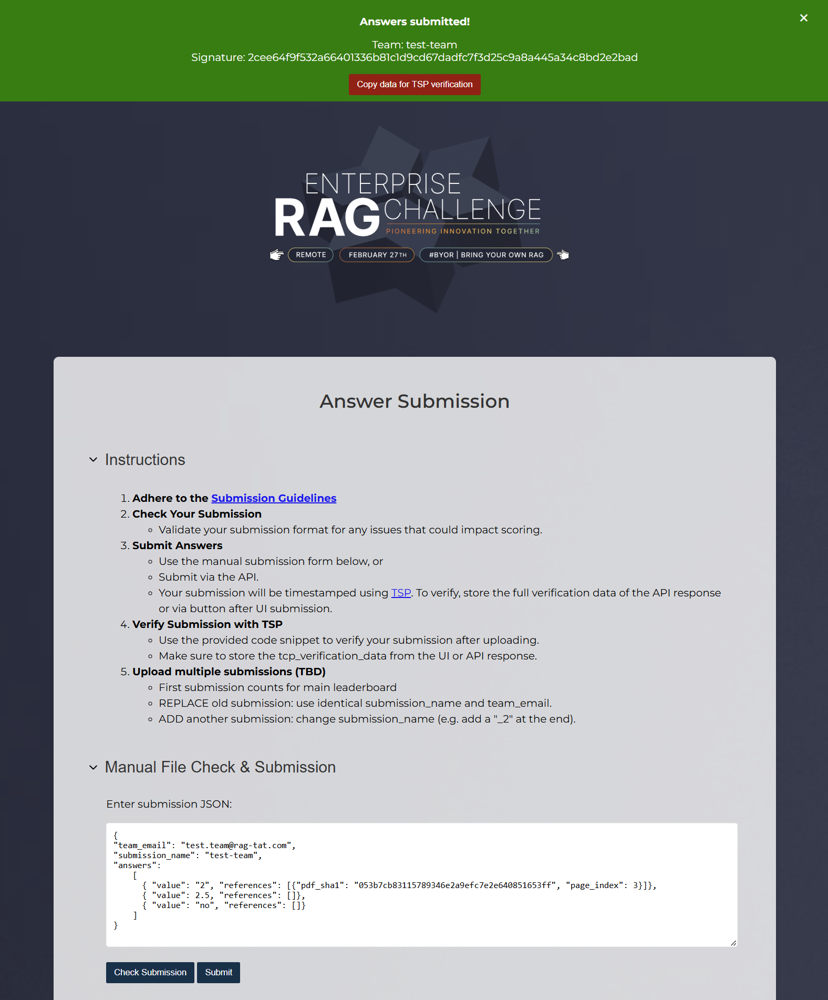

# Enterprise RAG Challenge UI & Submission Handling

Codebase for the Submission API and UI for the TIMETOACT 
[Enterprise RAG Challenge](https://www.timetoact-group.at/details/enterprise-rag-challenge) 
taking place on 27th of February 2025.



## Getting Started

Install dependencies

```bash
conda env create -f environment.yml
```

Activate the environment

```bash
conda activate rag-challenge-ui
``` 

Run the app

```bash
python -m uvicorn src.main:app --reload
```

## Test submission with curl

### Test UI submission (string)

```bash
curl -X 'POST' \
  'http://127.0.0.1:8000/submit-ui' \
  -H 'accept: application/json' \
  -H 'Content-Type: application/x-www-form-urlencoded' \
  -d 'content=%5B%7B%22question%22%3A%22Q1%22%2C%22schema%22%3A%22name%22%2C%22answer%22%3A%22A1%22%7D%2C%7B%22question%22%3A%22Q2%22%2C%22schema%22%3A%22number%22%2C%22answer%22%3A2.5%7D%2C%7B%22question%22%3A%22Q2%22%2C%22schema%22%3A%22boolean%22%2C%22answer%22%3Atrue%7D%5D'
```

### Test json file submission

```bash
curl -X 'POST' \
  'http://127.0.0.1:8000/submit' \
  -H 'accept: application/json' \
  -H 'Content-Type: multipart/form-data' \
  -F 'file=@test/samples/sample_answer.json;type=application/json'
```

### Test submission data check and submission with python

Run the file [`submit_via_API.py`](submit_via_API.py).

### Run unittests
Note, that running the tests will generate two submissions, which will 
be stored in the specified path 

```bash
pytest
```


## Schema

```json
{
  "team_name": "xy",
  "contact_mail_address": "xy@test.com",
  "submissions": [
    {
      "question": "Q1",
      "schema": "name",
      "answer": "A1"
    },
    {
      "question": "Q2",
      "schema": "number",
      "answer": 2.5
    },
    {
      "question": "Q2",
      "schema": "boolean",
      "answer": true
    },
    {
      "question": "Q2",
      "schema": "boolean",
      "answer": "n/a"
    },
    ...
  ]
}
```

Also see the sample answer in the file [`sample_answer.json`](test/samples/sample_answer.json).